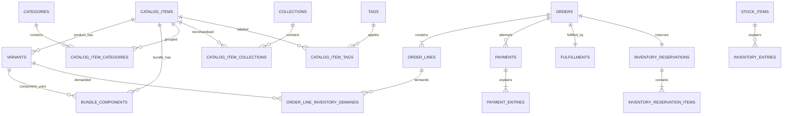

# Ecommerce D1 schema contract

**Decision status:** Founder reviewed for Wayfinder issue #23.

This contract defines the shared physical schema and migration boundary for every independently deployed Store. It implements the accepted commerce, presentation, identity, search, and reliability contracts at the Target Store scale of roughly 10–20 Orders per day, comfortable operation around 50 Orders per day, and audiences up to roughly 50,000 followers.

## Deliberate simplifications and overrides

The schema spends complexity only on commercial truth, authorization, retry safety, and useful evidence.

- Each Store has its own D1 database. Store-local tables do not repeat `store_id`, and there is no multi-tenant `stores` table.
- Mutable Admin records use last-write-wins. General optimistic `revision` columns are omitted, overriding the earlier commerce and CMS recommendation. Atomic state predicates still protect Orders, Payments, inventory, and Fulfillment.
- One compact `audit_events` table replaces a generic Domain Event store. Payment and inventory facts remain in their dedicated append-only entries and are not duplicated in Audit Events.
- Cloudflare Workflow remains the retry coordinator. There is no D1 job runner, generic outbox, notification-delivery table, or Failed Notifications workflow. The handoff from a committed D1 change to Workflow creation is intentionally best-effort.
- Provider-specific tables are excluded. Byl and direct QPay translate into the canonical Payment schema.
- The approved minimal Media Asset shape is preserved. D1 does not store dimensions, byte size, digests, provenance, derivatives, or orphan-processing state.
- JSON is exceptional. Current commercial truth remains relational; only bounded nested display details that are immutable and read with their Order Line use validated JSON.

These overrides are intentional founder decisions for the stated operating scale, not accidental omissions.

## Physical conventions

### D1 and Drizzle representation

| Domain value | D1 representation | Rule |
| --- | --- | --- |
| Application identity | `TEXT` | Canonical TypeID string |
| Better Auth identity | `TEXT` | Better Auth-generated opaque identifier |
| Money | `INTEGER` | Non-negative MNT, never floating point |
| Quantity | `INTEGER` | Positive for requested quantities; signed only in ledger deltas |
| Boolean | `INTEGER` | `0` or `1` with a `CHECK` |
| Timestamp | `INTEGER` | UTC Unix milliseconds through Drizzle `timestamp_ms` |
| State or kind | `TEXT` | Closed lowercase value with a `CHECK` |
| Structured document | `TEXT` | Canonical JSON with `json_valid`; validated on write and read |

Foreign keys are enabled. Owned joins and replaceable Draft children may cascade. Commerce history uses `RESTRICT`; presentation references use `SET NULL` only where absence is valid. Every foreign-key column used for reverse lookup receives an index.

Consequential commands build prepared statements and send reads and writes in a small number of D1 calls. Atomic writes use one D1 `batch()`, which executes as a transaction and rolls the batch back when a statement fails. More tables must not become one remote call per table.

### TypeIDs

Application entities use the official `typeid-js` unboxed string API. The official specification defines a lowercase snake-case prefix of at most 63 characters, an underscore separator, and a 26-character base32 UUIDv7 suffix. The canonical value is stored directly as `TEXT`.

- Generate with `typeidUnboxed(prefix)`.
- Parse external or database values with `fromString(value, prefix)`.
- Serialize the branded string unchanged.
- Reject malformed, non-canonical, or wrong-prefix values at every input and persistence boundary.
- Do not use unchecked casts or type assertions. Repository codecs validate values before they enter typed application code.
- A TypeID identifies entity kind. Store ownership comes from the bound D1 database, not from encoded tenant data.

Official sources: [TypeID specification v0.3.0](https://github.com/jetify-com/typeid/blob/661c8639faec1f5598036e548cc1e06a51ac958d/spec/README.md#L18-L59) and [`typeid-js` unboxed API](https://github.com/jetify-com/typeid-js/blob/fa45fe79cc4f78614ab0e6c713dd6b732aa67299/src/unboxed/README.md#L29-L91).

| Prefix | Entity |
| --- | --- |
| `product` / `bundle` | row in `catalog_items`, checked against `kind` |
| `variant` | Variant |
| `option_group` / `option_value` | Product option definition |
| `personalization` / `personalization_value` | Personalization definition and select value |
| `category` / `collection` / `tag` | Catalog grouping |
| `media` | Media Asset |
| `discount` / `discount_redemption` | Discount Rule and redemption entry |
| `order` / `order_line` / `order_discount` / `order_note` | Order records |
| `payment` / `payment_entry` | Payment attempt and immutable entry |
| `fulfillment` | Fulfillment |
| `stock_item` / `reservation` / `inventory_entry` | Inventory records |
| `customer` / `tracking_link` | Customer and Guest Tracking Link |
| `staff` / `telegram_binding` | Staff authority records |
| `location` / `ordering_notice` / `homepage_section` | CMS entities with stable identity |
| `audit_event` | Audit Event |

Pure join rows use composite primary keys. Singleton records use fixed keys. Better Auth records retain Better Auth-generated IDs.

### JSON boundary

Only these fields are JSON in v1:

- `themes.tokens_json`, because Theme tokens are one bounded versioned document;
- `homepage_sections.content_json`, because each approved section kind has a different bounded payload;
- `order_lines.options_json`, for immutable selected Option snapshots;
- `order_lines.personalizations_json`, for immutable validated Personalization answers;
- `order_lines.bundle_components_json`, for immutable customer-visible Bundle component snapshots;
- `payment_entries.evidence_json`, only when normalized relational evidence cannot preserve a required redacted provider fact;
- `audit_events.metadata_json`, for concise, non-PII before/after facts.

Each field has a named Valibot schema selected by record kind. Reads parse and validate before returning typed data. Unknown keys fail validation. No authoritative amount, state, SKU, inventory demand, Refund allocation, or mutable relationship is hidden in JSON. Order Line option, Personalization, and Bundle component documents are bounded, immutable snapshots read as a whole; source identities, keys, labels, and values remain fully represented inside their validated schemas.

## Relationship overview

## Store settings and presentation

There is no Store tenancy row. `commerce_settings` is one editable singleton with fixed key `commerce`.

### `commerce_settings`

- `key TEXT PRIMARY KEY CHECK (key = 'commerce')`
- `active_automated_payment_provider TEXT NULL CHECK ('byl', 'direct_qpay')`
- `bank_transfer_enabled INTEGER NOT NULL CHECK (0,1)`
- `cash_on_delivery_enabled INTEGER NOT NULL CHECK (0,1)`
- `customer_accounts_enabled INTEGER NOT NULL CHECK (0,1)`
- `telegram_enabled INTEGER NOT NULL CHECK (0,1)`
- `delivery_enabled INTEGER NOT NULL CHECK (0,1)`
- `delivery_fee_mnt INTEGER NOT NULL CHECK (>= 0)`
- `free_delivery_threshold_mnt INTEGER NULL CHECK (>= 0)`
- `updated_at INTEGER NOT NULL`

The Store Profile remains the build-time capability ceiling. This row may enable only capabilities statically supported by the Profile and required bindings. Secrets never enter D1.

## Catalog and merchandising

### `catalog_items`

One table contains the common public identity for Products and Bundles.

- `id TEXT PRIMARY KEY`
- `kind TEXT NOT NULL CHECK ('product', 'bundle')`
- `slug TEXT NOT NULL UNIQUE`
- `state TEXT NOT NULL CHECK ('draft', 'published', 'archived')`
- `name TEXT NOT NULL`
- `subtitle TEXT NULL`
- `description_markdown TEXT NULL`
- `brand_text TEXT NULL`
- `price_mnt INTEGER NOT NULL CHECK (> 0)`
- `merchandising_position INTEGER NULL`
- `purchase_notice_id TEXT NULL`
- `created_at`, `updated_at`, `published_at`, `archived_at INTEGER`

`product_…` and `bundle_…` prefixes must match `kind`. Archived IDs and slugs are never reused. Product publication requires at least one Active Variant. Bundle publication requires at least one component and one locked SKU.

Indexes: `(state, kind, merchandising_position, id)`, `(kind, state, slug)`.

### `skus`

This shared registry enforces one permanent SKU namespace across Variants and Bundles and supplies exact search lookup.

- `sku TEXT NOT NULL UNIQUE`
- `sku_compact TEXT PRIMARY KEY`
- `owner_kind TEXT NOT NULL CHECK ('variant', 'bundle')`
- `variant_id TEXT NULL UNIQUE REFERENCES variants(id) RESTRICT`
- `bundle_id TEXT NULL UNIQUE REFERENCES catalog_items(id) RESTRICT`
- `locked_at INTEGER NULL`
- `created_at`, `updated_at INTEGER NOT NULL`

Exactly one owner column is present and agrees with `owner_kind`; application validation also requires a Bundle target for `bundle_id`. Draft SKUs may change. `locked_at` is set at first publication and the row is thereafter retained permanently, including after archival.

### Product options and Variants

`option_groups`

- TypeID `id`, `product_id` foreign key, stable `key`, label, position, state `active|archived`, timestamps
- unique `(product_id, key)` and `(product_id, position)`

`option_values`

- TypeID `id`, `option_group_id` foreign key, stable `key`, label, position, state `active|archived`, timestamps
- unique `(option_group_id, key)` and `(option_group_id, position)`

`variants`

- TypeID `id`, `product_id` foreign key, `price_override_mnt` nullable positive integer, `is_default` boolean, state `active|archived`, timestamps
- unique partial index on `product_id WHERE is_default = 1`
- index `(product_id, state)`

`variant_option_values`

- `variant_id`, `option_value_id`
- composite primary key `(variant_id, option_value_id)`
- one selected value per Option Group is enforced by the Variant repository when the complete combination is written

### Personalization

`personalization_definitions`

- TypeID `id`, `catalog_item_id`, stable `key`, kind `text|select|checkbox`, label, required boolean, max text length, position, state `active|archived`, timestamps
- unique `(catalog_item_id, key)` and `(catalog_item_id, position)`

`personalization_select_values`

- TypeID `id`, `personalization_id`, stable `value`, label, position, state `active|archived`
- unique `(personalization_id, value)` and `(personalization_id, position)`

### Bundles

`bundle_components`

- `bundle_id` foreign key to `catalog_items`
- `variant_id` foreign key to `variants`
- `quantity INTEGER NOT NULL CHECK (> 0)`
- composite primary key `(bundle_id, variant_id)`

Application validation requires the parent to be a Bundle. Components lock at first Bundle publication. Bundles cannot reference Bundles and never receive Stock Items.

### Groupings

`categories`

- TypeID `id`, unique slug, name, nullable `parent_id`, position, state `draft|active|archived`, timestamps
- index `(parent_id, state, position)`
- the command boundary prevents cycles and active children under archival

`collections`

- TypeID `id`, unique slug, name, description, state `draft|active|archived`, timestamps

`tags`

- TypeID `id`, label, normalized label, state `draft|active|archived`, timestamps
- unique normalized label

Join tables:

- `catalog_item_categories(catalog_item_id, category_id)`
- `catalog_item_collections(catalog_item_id, collection_id, position)` with unique `(collection_id, position)`
- `catalog_item_tags(catalog_item_id, tag_id)`

Each uses the two foreign keys as its composite primary key.

### Discounts

`discount_rules`

- TypeID `id`, name, mode `automatic|code`, nullable normalized code
- calculation `percentage|fixed_mnt`, integer value with mode-specific checks
- target scope `all|selected`
- state `draft|active|inactive`
- optional starts/ends timestamps, minimum subtotal, and positive global redemption limit
- created, updated, activated, deactivated timestamps
- unique partial normalized code where non-null
- indexes `(state, starts_at, ends_at)` and `(mode, normalized_code)`

Target joins:

- `discount_catalog_items(discount_id, catalog_item_id)`
- `discount_variants(discount_id, variant_id)`
- `discount_categories(discount_id, category_id)`
- `discount_collections(discount_id, collection_id)`

`discount_redemption_entries`

- TypeID `id`, `discount_id`, `order_id`
- kind `claim|release`, `quantity_delta` constrained to `1|-1`
- command correlation, timestamp
- unique `(discount_id, order_id, kind)`
- index `(discount_id, created_at)`

## Media and CMS

### `media_assets`

The approved minimal metadata row contains only:

- TypeID `id`
- `object_key TEXT NOT NULL UNIQUE`
- `declared_content_type TEXT NOT NULL CHECK ('image/jpeg', 'image/png', 'image/webp')`
- `created_at INTEGER NOT NULL`

R2 objects are random-keyed and immutable. Contextual alt text belongs to each reference.

`catalog_item_images` and `variant_images` contain owner ID, Media Asset ID, position, and contextual alt text. Their owner and position form the primary key; `(owner_id, media_asset_id)` is unique.

### Draft and Published rows

Every CMS version row carries `status TEXT CHECK ('draft','published')`. A stable aggregate ID is repeated across its optional Draft and required Published rows; `(aggregate identity, status)` is the primary key. Singleton tables use `status` as their primary key. There is no retained version history or optimistic Revision.

Publishing runs in one transaction: replace the Published row and its owned children from Draft, then delete Draft. Public reads always require `status = 'published'`.

### CMS tables

`storefront_identities`

- primary key `status`
- display name, optional legal name, tagline, summary
- nullable logo and favicon Media Asset foreign keys
- public phone and email
- created, updated, published timestamps

`storefront_social_links`

- identity status, approved platform, validated HTTPS URL, position
- composite primary key `(identity_status, platform)`

`themes`

- primary key `status`
- Theme schema version, validated `tokens_json`, primary and optional secondary approved font IDs, timestamps

`homepages`

- primary key `status`, timestamps

`homepage_sections`

- TypeID `id`, `homepage_status`, kind, position, enabled boolean
- validated `content_json`
- nullable explicit Media Asset, Catalog Item, Collection, and Location identities required by the selected kind
- composite primary key `(id, homepage_status)` and unique `(homepage_status, position)`

Allowed kinds are `hero`, `featured_collection`, `product_rail`, `promotion_grid`, `image_with_text`, `rich_text`, `locations`, and `trust_highlights`.

`announcements`

- primary key `status`
- message, nullable typed internal destination, emphasis `neutral|promotion|important`, enabled boolean, timestamps

`ordering_notices`

- TypeID `id`, status, name, plain text, timestamps
- composite primary key `(id, status)`

`ordering_notice_placements`

- notice identity, notice status, placement `product|cart|checkout`
- composite primary key `(notice_id, notice_status, placement)`

`navigation_menus`

- kind `primary|footer`, status, timestamps
- composite primary key `(kind, status)`

`navigation_groups`

- TypeID `id`, menu kind/status, label, position
- composite primary key `(id, menu_kind, menu_status)`

`navigation_items`

- TypeID `id`, menu kind/status, nullable group and parent item identity, label, position, enabled boolean
- destination kind `home|category|collection|catalog_item|location|policy|external`
- nullable typed destination identity or validated HTTPS URL, plus `open_in_new_tab`
- composite primary key `(id, menu_kind, menu_status)`

The navigation publisher validates exactly one destination, active references, maximum depth, and cycles before replacing Published rows. Polymorphic CMS destinations are deliberately application-validated rather than backed by a generic entity registry.

`locations`

- TypeID `id`, status, name, public address, optional phone, opening-hours text
- optional validated map URL, active boolean, Pickup-enabled boolean, timestamps
- composite primary key `(id, status)`

`policies`

- kind `terms|privacy|delivery|returns_refunds|payment`, status
- title, constrained Markdown body, timestamps
- composite primary key `(kind, status)`

No generic Pages, CMS history, schedules, redirects, arbitrary HTML, arbitrary CSS, or page-builder tables exist.

## Identity and authorization

### Better Auth namespaces

Two Better Auth configurations generate separate physical table sets:

- `staff_auth_users`, `staff_auth_accounts`, `staff_auth_sessions`, `staff_auth_verifications`
- `customer_auth_users`, `customer_auth_accounts`, `customer_auth_sessions`, `customer_auth_verifications`

The Staff user schema supports verified Google email. The Customer user schema adds unique normalized phone and phone-verification fields required by the Better Auth phone plugin. Table and field names come from explicit `modelName`/field configuration in `scripts/auth-schema.config.ts`; implementation must run the generator after configuring both instances instead of hand-maintaining auth columns.

Sessions, verification records, OTP attempt state, and rate-limit counters use the approved separately prefixed KV secondary-storage namespaces. The generated D1 tables remain independently namespaced for Better Auth compatibility and migrations; runtime configuration must not allow one instance to read the other namespace.

### `staff_members`

- TypeID `id`
- `normalized_email TEXT NOT NULL UNIQUE`
- nullable unique `staff_auth_user_id`
- nullable role `owner|manager|staff`
- status `pending|active|revoked`
- created, updated, approved, revoked timestamps

Checks require an Active Staff Member to have a role. The command transaction prevents revoking, deleting, or demoting the final active Owner. Rejected pending records may be hard-deleted. Revocation deletes that Staff Member's sessions.

### `customers`

- TypeID `id`
- unique `customer_auth_user_id`
- unique immutable `phone_normalized`
- `verified_at`, `created_at` timestamps

There is no address book, cross-Store identity, merge table, or phone-change workflow in v1.

### Telegram action state

There is no `telegram_bindings` table. Exact Telegram operator IDs and short audit labels are founder-maintained deployment configuration. Opaque bounded Payment action references live in the prefixed KV namespace. Financial actions use current-state predicates and immutable financial evidence.

### `guest_tracking_links`

- TypeID `id`
- unique `order_id`
- unique SHA-256 `token_hash`
- `expires_at`, nullable `revoked_at`, `created_at`

Only the raw high-entropy token returned once to the shopper can use the link. D1 never stores it recoverably.

## Orders and immutable snapshots

### `orders`

- TypeID `id`, human-facing monotonically allocated `order_number` unique
- nullable `customer_id`, nullable `customer_linked_at`
- state `placed|completed|cancelled`
- immutable recipient name and normalized phone
- immutable currency fixed to `MNT`
- subtotal, discount total, delivery fee, and grand total integer-MNT columns with non-negative checks
- delivery mode `delivery|pickup`
- immutable delivery address fields or Pickup Location ID, name, and address snapshots
- free-delivery-threshold result and policy/version references needed to explain checkout
- cancellation reason and terminal timestamps
- created and placed timestamps

Checks enforce mode-specific destination fields and `grand_total = subtotal - discount_total + delivery_fee`. Indexes: `(state, created_at)`, `(customer_id, created_at)`, and partial `(recipient_phone_normalized, created_at) WHERE customer_id IS NULL` for Guest linking.

### `order_lines`

- TypeID `id`, `order_id`, stable position
- Catalog Item ID and kind snapshot
- nullable Variant ID
- item, Variant, and SKU display snapshots
- quantity, unit price, pre-discount total, discount total, final line total
- validated `options_json` containing ordered source IDs, machine keys, labels, and values
- validated `personalizations_json` containing ordered definition IDs/versions, kinds, labels, and typed scalar values
- validated `bundle_components_json` containing ordered Variant IDs, SKU/name snapshots, and per-bundle and total quantities; empty for Product lines
- unique `(order_id, position)`

The three JSON documents are bounded immutable display snapshots and are normally loaded with the Order Line. Keeping them on the row avoids three child tables and their joins. Inventory Demand and Discount allocation remain relational because commands query and reconcile them independently.

### Relational operational snapshots

`order_line_inventory_demands`

- Order Line and Variant source ID, required quantity
- composite primary key `(order_line_id, variant_id)`

`order_discount_adjustments`

- TypeID `id`, Order ID, nullable source Discount Rule ID
- immutable rule name/code/calculation/reason snapshots and total amount

`order_discount_allocations`

- adjustment ID, Order Line ID, amount
- composite primary key `(adjustment_id, order_line_id)`

`order_notes`

- TypeID `id`, Order ID, kind `contact_instruction|staff_note|courier_reference`
- text, actor Staff ID, source channel, timestamp

These rows append operational corrections without rewriting checkout snapshots.

## Payments

### `payments`

- TypeID `id`, Order ID, positive attempt number
- method `qpay|bank_transfer|cash_on_delivery`
- automated provider `byl|direct_qpay` only for QPay
- state `pending|awaiting_confirmation|confirmed|failed|expired|rejected|partially_refunded|refunded`
- expected, confirmed, and refunded integer-MNT balances
- optional unique provider attempt/reference fields
- optional authenticated provider deadline and effective deadline
- optional Cloudflare Workflow instance ID
- Refund Obligation amount and state `none|open|partially_satisfied|satisfied`
- created, confirmed, rejected, expired, updated timestamps
- unique `(order_id, attempt_number)`
- at most one active collectible attempt per Order through a partial unique index
- deadline/status and provider-reference indexes

### `payment_entries`

One ordered immutable history table covers normalized Payment Evidence and Financial Entries.

- TypeID `id`, `payment_id`, sequence number
- kind `expected|evidence_received|confirmed|rejected|failed|expired|refunded|correction`
- integer-MNT delta and resulting confirmed/refunded balances
- optional provider reference and observed-at timestamp
- actor kind `system|provider|staff`, nullable Staff ID, source channel
- mandatory reason where human action or correction requires it
- command correlation ID
- Refund allocation target `none|order_line|delivery`, nullable Order Line ID
- optional validated redacted `evidence_json`
- created timestamp
- unique `(payment_id, sequence)` and provider-reference uniqueness where present

A Refund across multiple Order Lines produces multiple `refunded` entries sharing one command correlation ID. Their amounts sum to the recorded Refund action. Payment balances must reconcile to entries. Generic Audit Events do not duplicate these facts.

## Inventory

### `stock_items`

- TypeID `id`
- unique `variant_id`
- non-negative `on_hand_quantity` and `reserved_quantity`
- updated timestamp
- check `reserved_quantity <= on_hand_quantity`

Available Quantity is derived as on-hand minus reserved.

### `inventory_reservations`

- TypeID `id`
- unique `order_id`
- state `active|consumed|released|expired`
- nullable deadline
- created and transitioned timestamps
- index `(state, deadline)`

### `inventory_reservation_items`

- Reservation ID, Variant ID, positive quantity
- composite primary key `(reservation_id, variant_id)`

### `inventory_entries`

- TypeID `id`, Stock Item ID
- optional Reservation and Order IDs
- kind `adjustment|reservation|release|expiry|consumption|restoration`
- signed on-hand and reserved deltas
- resulting on-hand and reserved balances
- actor kind, nullable Staff ID, mandatory reason for manual adjustments
- command correlation ID, created timestamp
- unique correlation per affected Stock Item and operation
- index `(stock_item_id, created_at, id)`

Every balance update and its Inventory Entry commit in the same batch. Bundle demand is expanded to component Variants before reservation. Generic Audit Events do not duplicate inventory ledger facts.

## Fulfillment

### `fulfillments`

- TypeID `id`
- unique `order_id`
- mode `delivery|pickup`, matching the Order snapshot
- state `unfulfilled|processing|ready|handed_off|picked_up|delivery_failed|returned|fulfilled|cancelled`
- nullable courier reference and latest operational note
- state-specific timestamps and updated timestamp
- index `(state, updated_at)`

Exactly one Fulfillment belongs to each Order. State predicates and related Payment/Reservation conditions are checked atomically by shared-kernel commands.

## Audit and retry safety

### `audit_events`

- TypeID `id`
- actor kind `system|staff|customer|provider`, nullable actor ID and Staff role snapshot
- source channel `admin|storefront|provider_callback|workflow|telegram|provisioning`
- action and outcome `accepted|rejected`
- entity kind and entity ID
- mandatory reason where required
- command correlation ID
- optional concise validated `metadata_json`
- created timestamp
- indexes `(entity_kind, entity_id, created_at)` and `(actor_kind, actor_id, created_at)`

Record Staff authority changes, catalog publication and price changes, Discount activation, Order cancellation, Fulfillment transitions, provider-setting changes, CMS publication, and consequential rejected attempts. Do not record reads, searches, previews, draft keystrokes, bearer secrets, or unnecessary direct PII. Payment and inventory history remains in dedicated entries.

There is no `domain_events`, `jobs`, `outbox`, `notification_deliveries`, or generic adapter-data table.

## Search projection

### `catalog_search`

One custom SQL migration creates an ordinary/contentful FTS5 virtual table for Published Products and Bundles. It contains one row per searchable Catalog Item with:

- unindexed Catalog Item ID and kind;
- weighted normalized title and brand fields;
- normalized Category/Tag text;
- normalized description and useful Variant option text;
- slug and display projection required by bounded search hydration.

Use `unicode61` with the approved application normalization and small `prefix='2 3'` index. Product and Bundle canonical rows, `skus`, and FTS projection update in one D1 batch. Exact `skus.sku_compact` lookup runs before FTS. Variant SKU matches return the parent Product; Bundle SKU matches return the Bundle.

`search_index_state` is one fixed-key row containing normalization version, projection version, indexed document count, and last successful rebuild timestamp. It supports diagnostics and deliberate rebuilds, not a second source of truth.

Search SQL remains inside one server-only repository. Dynamic values are parameterized and never passed through raw SQL interpolation. FTS rows never carry stock quantity or authoritative availability.

## Index policy

Create only indexes tied to known access paths:

- every foreign key used for parent-to-child lookup;
- public catalog state/slug and grouping page order;
- exact canonical and compact SKU uniqueness;
- active Discount eligibility and code lookup;
- Orders by Customer, state, date, and unclaimed normalized phone;
- active Payment attempt, provider reference, and QPay deadline;
- active Reservation deadline;
- Stock Item by Variant and ledgers by owner/time;
- pending Staff email and active role;
- Guest Tracking token hash and expiry;
- Audit Event entity/actor timelines.

Do not add speculative covering indexes. Use D1 query plans and measured production-like proof before adding more.

## Migration boundary

Every Store database runs one immutable ordered migration plan from the shared schema package:

1. application tables, constraints, and ordinary indexes;
2. Staff Better Auth generated schema;
3. Customer Better Auth generated schema;
4. the custom FTS5 table and search diagnostics;
5. statically imported adapter-owned migrations only if an accepted adapter later proves it needs private persistence.

Byl and direct QPay require no adapter tables in v1. There is no runtime plugin discovery or per-merchant schema branch. An app's Store Profile statically registers adapters and contributes their known migrations to the same build-time list. Applied migration names are unique and append-only. A migration is never reordered or edited after any Store has applied it.

Schema changes run through Drizzle generation and the repository migration commands. Better Auth plugin changes first update both schema-generation configurations and regenerate the namespaced auth schema. Provisioning applies migrations from zero before seed and deploy proof; it resumes after failure without destructive automatic rollback.

## Transaction boundaries

The implementation must preserve these atomic groups:

- **Place Order:** Order and relational snapshots, Discount claim, Inventory Reservation and entries, initial Payment when due, Fulfillment, and relevant Audit Event.
- **Confirm or reject Payment:** conditional Payment state, Payment Entries, Reservation consume/release and Inventory Entries, Order consequence, Refund Obligation when relevant.
- **QPay expiry:** conditional Payment expiry, Reservation expiry, inventory release, unpaid Order cancellation, and Discount release.
- **Record Refund:** Payment Entries and reconciled Payment/refund-obligation balances.
- **Adjust inventory:** conditional Stock Item balance and one Inventory Entry.
- **Publish CMS:** replace one Published aggregate and children from Draft, then remove Draft. Cache purge follows the commit and may report a partial outcome.
- **Staff authority change:** Staff state/role, affected Better Auth session deletion, and Audit Event.

Conditional state updates must affect exactly one expected row. Zero affected rows return a typed conflict or already-resolved result. Constraints and current-state predicates protect transitions; callers must not automatically retry effectful requests.

## Excluded schema

V1 deliberately has no:

- repeated Store tenancy columns or cross-Store records;
- generic entity registry or extension-property table;
- generic state-machine definitions;
- optimistic Revision columns or CMS history;
- cart, server-side draft checkout, or saved-address tables;
- independent Bundle inventory;
- customer files or media-processing pipeline;
- page builder, arbitrary Pages, redirects, arbitrary SEO, or schedules;
- tax engine, multi-currency, split tender, exchanges, or returns workflow;
- courier integration, geospatial zones, warehouse/location stock, or shipment splits;
- generic Domain Event store, job queue, outbox, or notification-delivery records;
- provider-specific Byl/QPay persistence;
- AI, Vectorize, semantic-search, or Durable Object search state;
- distributed coordination, sharding, compliance archive, or speculative analytics warehouse.

## Implementation proof handoff

The implementation ticket must prove the schema against real local D1 and then a provisioned D1 binding:

- migrations run from zero and rerun as a no-op;
- foreign keys and `CHECK` constraints reject invalid rows;
- exact SKU uniqueness spans Variants and Bundles;
- a batched Place Order reserves all demanded Variant stock or none;
- retrying checkout returns one Order;
- Payment and inventory balances reconcile to append-only entries;
- Guest linking attaches only matching unclaimed Orders without changing contact snapshots;
- Draft CMS changes never alter Published reads;
- FTS rebuild and Product/Bundle search agree with canonical Published rows;
- Staff and Customer Auth tables, cookies, KV keys, and identities cannot cross namespaces.

Proof uses actual Drizzle, D1, curl, browser, Workflow, Better Auth, and provider infrastructure as required by repository policy. Missing credentials are reported as blocked rather than replaced by mocks or test doubles.
